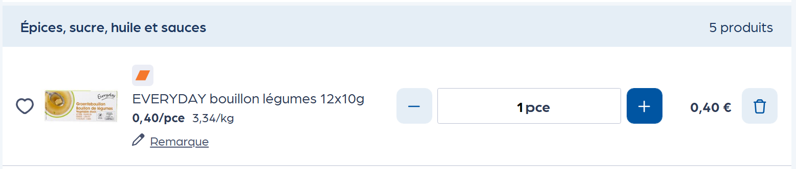
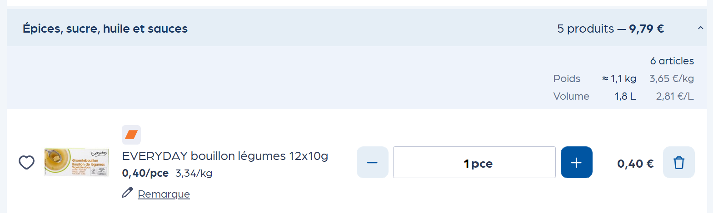
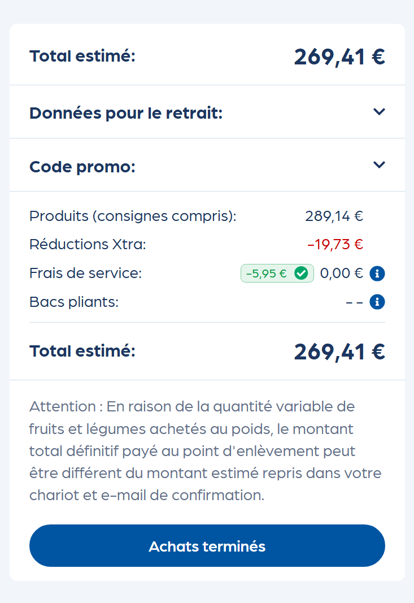
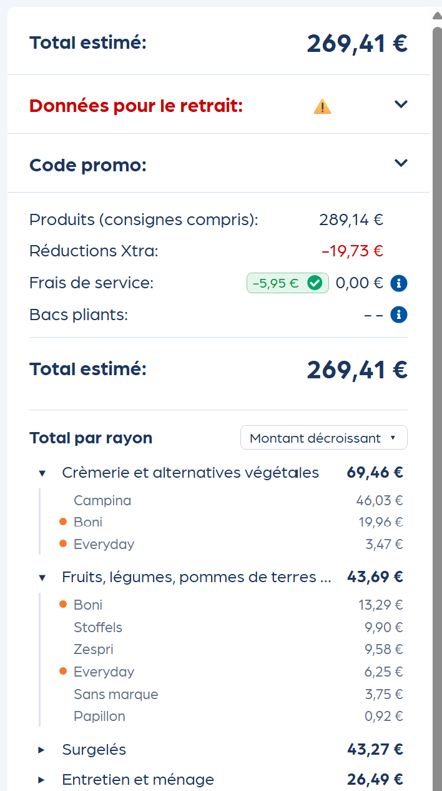

<div align="center">

**🌐 Langue / Taal : [🇫🇷 Français](#francais) · [🇳🇱 Nederlands](#nederlands)**

</div>

<a id="francais"></a>

<div align="center">

# 🛒 Totaux par rayon — pour Collect&Go

**Extension Chrome non officielle qui enrichit la page panier de
[Collect&Go](https://www.collectandgo.be/fr/chariot) avec les totaux par
catégorie — pour savoir, d'un coup d'œil, combien coûte chaque rayon.**

[](manifest.json)
[](#-bilingue-fr--nl)
[](#-licence)

</div>

> ⚠️ **Non affilié.** Cette extension est un projet indépendant, **non
> officiel** et **sans aucune affiliation** avec Collect&Go ni Colruyt Group.
> « Collect&Go » et « Colruyt » sont des marques de leurs titulaires respectifs,
> citées ici uniquement à des fins descriptives (compatibilité). Aucun logo de
> la marque n'est utilisé. L'extension agit côté navigateur, ne collecte ni ne
> transmet aucune donnée, et n'interagit pas avec les serveurs de Collect&Go.

---

## 📸 Aperçu

### Totaux par rayon dans la liste

| Avant | Après |
|:---:|:---:|
|  |  |

### Récapitulatif dans la sidebar

| Avant | Après |
|:---:|:---:|
|  |  |

---

## ✨ Fonctionnalités

| | |
|---|---|
| 🧮&nbsp;**Totaux&nbsp;en&nbsp;liste** | Pour chaque section, la somme des prix s'affiche **en gras** à côté du compteur — sur une seule ligne. |
| 📋&nbsp;**Récap&nbsp;sidebar** | Un bloc **« Total par rayon »** apparaît sous le **Total estimé**, avec le détail de chaque rayon. |
| 🧺&nbsp;**Quantités&nbsp;totales** | En bas du récap, un **accordéon** additionne **tout le panier** : nombre d'articles, **poids total** (≈ kg, €/kg moyen) et **volume total** (L, €/L moyen). |
| 🏷️&nbsp;**Détail&nbsp;par&nbsp;marque** | Chaque rayon du récap est un **accordéon** : un clic sur le chevron dévoile le détail par marque (ex. Boni, Duyvis, Doritos…). Une **pastille orange** repère les **marques propres** Colruyt (Boni, Everyday, Bio-Time…). |
| 📦&nbsp;**Quantités&nbsp;par&nbsp;rayon** | Un clic sur un **en-tête de rayon** (à gauche) déplie un panneau discret : **nombre réel d'articles** (sachets/pièces) et, selon les produits, le **poids** (≈ kg, €/kg) et le **volume** (L, €/L). Poids/volume déduits du prix au kg/L (repli heuristique sur le libellé) → affiché en « ≈ ». |
| ↕️&nbsp;**Tri&nbsp;au&nbsp;choix** | Un menu déroulant trie le récap : montant décroissant, croissant, ou ordre de la liste. Le choix est mémorisé. |
| 🔗&nbsp;**Navigation&nbsp;rapide** | Cliquer sur un rayon du récap fait défiler la page jusqu'à lui, qui clignote brièvement. |
| 🛍️&nbsp;**Rayon&nbsp;en&nbsp;un&nbsp;clic** | Le **nom du rayon** dans l'en-tête de gauche devient un **lien** : un clic ouvre la **page d'assortiment** correspondante dans un **nouvel onglet** (pratique pour compléter ses courses). |
| 📌&nbsp;**Sidebar&nbsp;figée** | La colonne de droite reste visible pendant le défilement (sticky, avec défilement interne si besoin). |
| 🗂️&nbsp;**Sections&nbsp;repliées** | Les blocs **« Données pour le retrait »** (adresse + horaire) et **« Code promo »** sont repliés au démarrage — via l'accordéon **natif du site** — pour gagner de la place. Si l'adresse ou l'horaire manque, un **⚠️** s'affiche et le titre passe en **rouge** tant que le bloc est replié. |
| ⚙️&nbsp;**Réglages&nbsp;à&nbsp;la&nbsp;carte** | Un clic sur l'**icône de l'extension** ouvre un **popup** où l'on **active/désactive chaque fonction** (totaux en liste, récap, détail par marque, quantités totales, quantités par rayon, lien rayon, repli des blocs, alerte retrait, sidebar figée) et où l'on **choisit la langue** (**Auto · FR · NL** ; Auto suit la langue du chariot). L'effet est **immédiat** dans le chariot ouvert ; les choix sont mémorisés. |
| 🔄&nbsp;**Toujours&nbsp;à&nbsp;jour** | Les totaux se recalculent automatiquement à chaque changement de quantité (réactivité Vue.js). |
| 🛡️&nbsp;**Garde-fou&nbsp;structure** | Au chargement, l'extension fait quelques vérifications **heuristiques** de la structure. Si la page Collect&Go semble avoir évolué, elle **se désactive** et affiche un **bandeau** (à la place du détail dans la sidebar, ou en **rouge tout en haut** si l'ancrage a disparu), afin de **limiter** le risque de totaux erronés. Heuristique, donc sans garantie. |

> Exemple, dans l'en-tête d'un rayon :
>
> > **Boîtes, conserves et bocaux** — 7 produits **— 16,13 €**

---

## 🌍 Bilingue (FR / NL)

Le site existe en français et en néerlandais ; par défaut, l'extension
**s'adapte automatiquement** (mode **Auto**), d'après l'URL (`/fr/chariot` vs
`/nl/winkelwagen`) puis l'attribut `<html lang>`. Depuis le **popup** (icône de
l'extension), on peut aussi **forcer la langue** : **Auto · FR · NL** — le choix
est mémorisé et s'applique immédiatement aux libellés ajoutés. Les **liens vers
les rayons**, eux, restent toujours dans la langue du site (les noms y
correspondent).

| | 🇫🇷 Français | 🇳🇱 Nederlands |
|---|---|---|
| Titre du récap | Total par rayon | Totaal per afdeling |
| Tri | Montant décroissant / croissant / Ordre de la liste | Bedrag aflopend / oplopend / Volgorde van de lijst |

---

## 🚀 Installation (mode développeur)

1. Télécharger **[`dist/ext-colruyt.zip`](dist/ext-colruyt.zip)** (maintenu à
   jour à chaque changement de code) et le **décompresser**.
   *(Alternative : cloner le dépôt et utiliser le dossier directement.)*
2. Ouvrir `chrome://extensions`.
3. Activer le **Mode développeur** (en haut à droite).
4. Cliquer sur **« Charger l'extension non empaquetée »** et sélectionner le
   dossier décompressé (celui qui contient `manifest.json`).
5. Ouvrir le [chariot Collect&Go](https://www.collectandgo.be/fr/chariot) — les totaux apparaissent. ✅

> 🧪 **Testé sous Windows 11**, sur **Google Chrome** et **Brave**.

> Le zip est régénéré localement (`npm run build`) à chaque changement de code.
> Un workflow GitHub Actions **vérifie** qu'il est bien à jour à chaque push
> touchant une dépendance d'exécution (`manifest.json`, `pure.js`, `content.js`,
> `popup.html`, `popup.js`, `icons/`) — il échoue sinon, mais ne committe rien.

---

## ⚙️ Comment ça marche

- **Pages ciblées** : `*://www.collectandgo.be/*/chariot*` et
  `*://www.collectandgo.be/*/winkelwagen*` (le `*` final est requis : le chariot
  peut être ouvert avec un jeton en query, p. ex. `/fr/chariot?krypto=…`, et un
  match pattern compare le chemin **query comprise**).
- **Content script** injecté à `document_idle`.
- **Lecture des prix** : `.ds-product-total-price.is-p1__bold` — version desktop
  uniquement (la variante `--mobile` est ignorée), au format européen
  (`5,98 €`, virgule décimale).
- **Marques** : déduites du libellé produit (`.ds-product-tag`) — le **token en
  majuscules en tête** sert de marque (ex. « BONI ananas… » → `BONI`) ; à défaut,
  les produits sont regroupés sous « Sans marque ». L'accordéon est proposé pour
  **chaque rayon** (par cohérence, même mono-marque).
- **Sections** : `.category` → en-tête `.header.background-blue` + liste de
  produits ; chaque produit est un `.ds-product-list-item-container`.
- **Lien vers l'assortiment** : le nom du rayon est mis en correspondance (par
  libellé, insensible à la casse/aux accents) avec la page d'assortiment
  (`rootCategoryId` stable), en **FR** comme en **NL**. Si aucun rayon ne
  correspond (rayon temporaire, libellé inconnu…), **aucun lien n'est posé** —
  rien n'est cassé.
- **Recalcul** : un `MutationObserver` ciblé sur le wrapper Vue
  (`page-content`, avec repli sur `.basket` puis `body`) relance le calcul à
  chaque changement (quantité, suppression, promo…). La temporisation regroupe
  les mutations rapprochées (**~250 ms**) tout en garantissant une exécution
  au plus tard après **~800 ms** — pour ne pas être « affamée » par les
  mutations continues des scripts tiers de la page (chat, Tealium…).
  L'observateur se **rebranche** automatiquement si la SPA remplace son nœud
  racine, et un **filet de sécurité borné** (quelques secondes au démarrage)
  relance le calcul — pour que les totaux s'affichent de façon fiable quel que
  soit le navigateur (Chrome, Brave…) ou le timing de rendu de Vue.
- **Idempotence** : les compteurs `.count` traités sont marqués
  (`data-cg-total-processed`) ; la valeur est mise à jour en place plutôt que de
  rajouter un nœud. Les libellés sont écrits via `textContent` (pas d'injection HTML).
- **Auto-test de structure (heuristique)** : au chargement, l'extension fait
  quelques vérifications de la structure attendue (sections, compteur, prix
  lisible). Si la page semble avoir changé, elle **se désactive** et affiche un
  bandeau (sidebar, ou rouge en haut si l'ancrage a disparu) afin de **limiter**
  le risque de totaux faux. La détection patiente quelques cycles pour éviter
  les faux positifs pendant le rendu de la SPA — c'est une heuristique, sans
  garantie d'exhaustivité.
- **Non intrusif** : l'extension n'altère aucune fonctionnalité existante de la page.

---

## 📁 Structure du projet

```
ext-colruyt/
├── manifest.json     # Manifest V3 (content scripts, URLs ciblées)
├── pure.js           # Fonctions pures testables (parsePrice, formatPrice, …)
├── content.js        # Logique DOM : calculs, récap, tri, scroll, accordéons, styles
├── icons/            # Icônes 16 / 48 / 128 px
├── dist/             # ext-colruyt.zip (généré, prêt à installer)
├── scripts/          # build-zip.sh (« npm run build »)
├── test/             # Tests unitaires (node:test) des fonctions pures
├── .github/          # Workflow de vérification du zip
├── package.json      # « npm test » · « npm run build »
└── README.md
```

---

## 🧪 Tests

Les fonctions pures (sans DOM) — analyse/format des prix, détection de marque,
**extraction des quantités** (poids/volume depuis le libellé) — sont isolées
dans `pure.js` et couvertes par des tests unitaires, **sans aucune dépendance**
(`node:test`, intégré à Node) :

```bash
npm test
```

---

## 👤 Crédits

Développé par **InZeMobile SRL** — [www.inzemobile.com](https://www.inzemobile.com).

Projet indépendant, non affilié à Collect&Go ni à Colruyt Group.

---

## 🤝 Bonne foi & respect de la marque

Ce projet est né d'une **appréciation sincère du service Collect&Go** et n'a
qu'un seul objectif : améliorer le confort de l'utilisateur de son chariot.

- **Indépendant et non officiel** — aucune affiliation avec Collect&Go ni
  Colruyt Group, aucun logo de la marque utilisé.
- **Respectueux de la page** — lecture du DOM déjà affiché, **aucun appel
  serveur**, **aucune donnée** collectée ni transmise ; les composants
  existants ne sont pas altérés. Seules vos **préférences de réglages** (les
  fonctions activées/désactivées et le tri) sont mémorisées **localement** sur
  votre appareil (`chrome.storage.local`) — rien ne quitte le navigateur.
- **Fidèle au design** — nous avons veillé à **ne pas trahir le _look & feel_**
  de la page Collect&Go (couleurs, typographie, composants natifs), par respect
  pour le travail de leurs équipes ; nos ajouts s'y intègrent discrètement.
- **Léger** — nous avons veillé à **ne pas ralentir la page** : calculs
  regroupés (debounce), observation ciblée du seul panier, et reconstruction
  du DOM uniquement lorsque les données changent réellement.
- **Auditable** — code source ouvert, facile à relire pour une équipe sécurité.

> Ce respect de l'utilisateur et des sites tiers — confidentialité absolue,
> non-intrusion, transparence — est le **fondement éthique d'InZeMobile SRL**,
> appliqué à **tous** ses produits, qu'ils soient libres ou commerciaux.

Nous portons le plus grand respect à Collect&Go et à Colruyt Group. **À la
demande des titulaires de droits, nous adapterons ou retirerons volontiers**
tout élément concerné — il suffit d'ouvrir une *issue* sur ce dépôt ou de
contacter InZeMobile SRL.

Et bien sûr, **conformément à la licence MIT**, Colruyt Group est libre de
**réutiliser tout ou partie de ce code**, tel quel ou modifié. Nous demandons
seulement à en être **informés**, afin d'adapter ce qui deviendrait obsolète
dans le projet — voire de le retirer entièrement si l'idée est intégralement
reprise (une collaboration est d'ailleurs toujours possible 😉).

---

## ⚖️ Garantie & maintenance

Ce projet est fourni **« tel quel » (_as-is_)**, sans aucune garantie d'aucune
sorte.
InZeMobile SRL **ne saurait être tenue responsable**, de quelque manière que ce
soit, des conséquences de son utilisation — notamment, mais pas seulement,
d'éventuels dysfonctionnements liés aux **modifications futures de la page
Collect&Go**, qui peut évoluer à tout moment.

Nous **ne nous engageons pas** à maintenir ou à mettre à jour l'extension à
l'avenir. Cela dit, comme nous l'utilisons nous-mêmes au quotidien, il s'agit
d'un bon indice que nous ne traînerons pas pour la corriger 😉

---

## 📝 Licence

[MIT](LICENSE) — © InZeMobile SRL. Utilisez, modifiez et partagez librement.

---
---

<a id="nederlands"></a>

<div align="center">

**🌐 Taal / Langue : [🇳🇱 Nederlands](#nederlands) · [🇫🇷 Français](#francais)**

# 🛒 Totalen per afdeling — voor Collect&Go

**Niet-officiële Chrome-extensie die de winkelwagenpagina van
[Collect&Go](https://www.collectandgo.be/nl/winkelwagen) verrijkt met de totalen
per categorie — om in één oogopslag te zien hoeveel elke afdeling kost.**

[](manifest.json)
[](#-tweetalig-fr--nl)
[](#-licentie)

</div>

> ⚠️ **Niet-geaffilieerd.** Deze extensie is een onafhankelijk project,
> **niet-officieel** en **zonder enige band** met Collect&Go of Colruyt Group.
> "Collect&Go" en "Colruyt" zijn merken van hun respectieve eigenaars, hier
> uitsluitend vermeld voor beschrijvende doeleinden (compatibiliteit). Geen
> enkel merklogo wordt gebruikt. De extensie werkt aan de browserkant, verzamelt
> noch verzendt enige gegevens, en heeft geen interactie met de servers van
> Collect&Go.

---

## 📸 Voorbeeld

### Totalen per afdeling in de lijst

| Voor | Na |
|:---:|:---:|
|  |  |

### Overzicht in de zijbalk

| Voor | Na |
|:---:|:---:|
|  |  |

---

## ✨ Functies

| | |
|---|---|
| 🧮&nbsp;**Totalen&nbsp;in&nbsp;de&nbsp;lijst** | Voor elke sectie verschijnt de som van de prijzen **vetgedrukt** naast de teller — op één enkele regel. |
| 📋&nbsp;**Overzicht&nbsp;zijbalk** | Een blok **"Totaal per afdeling"** verschijnt onder het **Geschatte totaal**, met het detail van elke afdeling. |
| 🧺&nbsp;**Totale&nbsp;hoeveelheden** | Onderaan het overzicht telt een **accordeon** **de hele winkelwagen** op: aantal artikelen, **totaalgewicht** (≈ kg, gemiddelde €/kg) en **totaalvolume** (L, gemiddelde €/L). |
| 🏷️&nbsp;**Detail&nbsp;per&nbsp;merk** | Elke afdeling van het overzicht is een **accordeon**: een klik op de chevron onthult het detail per merk (bv. Boni, Duyvis, Doritos…). Een **oranje bolletje** markeert de **eigen merken** van Colruyt (Boni, Everyday, Bio-Time…). |
| 📦&nbsp;**Hoeveelheden&nbsp;per&nbsp;afdeling** | Een klik op een **afdelingskop** (links) klapt een discreet paneel open: **werkelijk aantal artikelen** (zakjes/stuks) en, afhankelijk van de producten, het **gewicht** (≈ kg, €/kg) en het **volume** (L, €/L). Gewicht/volume afgeleid uit de prijs per kg/L (heuristische terugval op het label) → weergegeven met "≈". |
| ↕️&nbsp;**Sortering&nbsp;naar&nbsp;keuze** | Een vervolgkeuzemenu sorteert het overzicht: bedrag aflopend, oplopend, of volgorde van de lijst. De keuze wordt onthouden. |
| 🔗&nbsp;**Snelle&nbsp;navigatie** | Op een afdeling in het overzicht klikken laat de pagina ernaartoe scrollen, waarbij die kort knippert. |
| 🛍️&nbsp;**Afdeling&nbsp;in&nbsp;één&nbsp;klik** | De **naam van de afdeling** in de linkerkop wordt een **link**: een klik opent de bijbehorende **assortimentspagina** in een **nieuw tabblad** (handig om je boodschappen aan te vullen). |
| 📌&nbsp;**Vastgezette&nbsp;zijbalk** | De rechterkolom blijft zichtbaar tijdens het scrollen (sticky, met interne scroll indien nodig). |
| 🗂️&nbsp;**Ingeklapte&nbsp;secties** | De blokken **"Gegevens voor het afhalen"** (adres + uur) en **"Promocode"** zijn ingeklapt bij het opstarten — via de **eigen accordeon van de site** — om plaats te besparen. Als het adres of het uur ontbreekt, verschijnt een **⚠️** en wordt de titel **rood** zolang het blok ingeklapt is. |
| ⚙️&nbsp;**Instellingen&nbsp;op&nbsp;maat** | Een klik op het **extensie-icoon** opent een **popup** waar je **elke functie in-/uitschakelt** (totalen in de lijst, overzicht, detail per merk, totale hoeveelheden, hoeveelheden per afdeling, afdelingslink, blokken inklappen, afhaalwaarschuwing, vaste zijbalk) en de **taal kiest** (**Auto · FR · NL**; Auto volgt de taal van de mand). Het effect is **onmiddellijk** in de geopende mand; de keuzes worden onthouden. |
| 🔄&nbsp;**Altijd&nbsp;up-to-date** | De totalen worden automatisch herberekend bij elke wijziging van de hoeveelheid (reactiviteit van Vue.js). |
| 🛡️&nbsp;**Structuurbeveiliging** | Bij het laden voert de extensie enkele **heuristische** controles van de structuur uit. Als de Collect&Go-pagina lijkt te zijn geëvolueerd, **schakelt ze zichzelf uit** en toont een **banner** (in plaats van het detail in de zijbalk, of in het **rood bovenaan** als het ankerpunt verdwenen is), om het risico op foutieve totalen te **beperken**. Heuristisch, dus zonder garantie. |

> Voorbeeld, in de kop van een afdeling:
>
> > **Dozen, conserven en bokalen** — 7 producten **— 16,13 €**

---

## 🌍 Tweetalig (FR / NL)

De site bestaat in het Frans en het Nederlands; standaard past de extensie
zich **automatisch aan** (modus **Auto**), op basis van de URL (`/fr/chariot`
vs `/nl/winkelwagen`) en daarna het attribuut `<html lang>`. Via de **popup**
(extensie-icoon) kan je de taal ook **forceren**: **Auto · FR · NL** — de keuze
wordt onthouden en geldt onmiddellijk voor de toegevoegde labels. De **links
naar de afdelingen** blijven steeds in de taal van de site (de namen komen
daarmee overeen):

| | 🇫🇷 Frans | 🇳🇱 Nederlands |
|---|---|---|
| Titel van het overzicht | Total par rayon | Totaal per afdeling |
| Sortering | Montant décroissant / croissant / Ordre de la liste | Bedrag aflopend / oplopend / Volgorde van de lijst |

---

## 🚀 Installatie (ontwikkelaarsmodus)

1. Download **[`dist/ext-colruyt.zip`](dist/ext-colruyt.zip)** (bij elke
   codewijziging up-to-date gehouden) en **pak het uit**.
   *(Alternatief: het repository klonen en de map rechtstreeks gebruiken.)*
2. Open `chrome://extensions`.
3. Activeer de **Ontwikkelaarsmodus** (rechtsboven).
4. Klik op **"Uitgepakte extensie laden"** en selecteer de uitgepakte map
   (die met `manifest.json`).
5. Open de [Collect&Go-winkelwagen](https://www.collectandgo.be/nl/winkelwagen) — de totalen verschijnen. ✅

> 🧪 **Getest op Windows 11**, met **Google Chrome** en **Brave**.

> De zip wordt lokaal opnieuw gegenereerd (`npm run build`) bij elke
> codewijziging. Een GitHub Actions-workflow **controleert** of die up-to-date
> is bij elke push die een runtime-afhankelijkheid raakt (`manifest.json`,
> `pure.js`, `content.js`, `icons/`) — anders faalt die, maar er wordt niets
> gecommit.

---

## ⚙️ Hoe het werkt

- **Doelpagina's**: `*://www.collectandgo.be/*/chariot*` en
  `*://www.collectandgo.be/*/winkelwagen*` (de afsluitende `*` is nodig: de mand
  kan met een token in de query openen, bv. `/nl/winkelwagen?krypto=…`, en een
  match pattern vergelijkt het pad **inclusief de query string**).
- **Content script** geïnjecteerd bij `document_idle`.
- **Prijzen lezen**: `.ds-product-total-price.is-p1__bold` — enkel de
  desktopversie (de variant `--mobile` wordt genegeerd), in Europees formaat
  (`5,98 €`, komma als decimaalteken).
- **Merken**: afgeleid uit het productlabel (`.ds-product-tag`) — het **token
  in hoofdletters vooraan** dient als merk (bv. "BONI ananas…" → `BONI`); bij
  gebrek daaraan worden de producten gegroepeerd onder "Zonder merk". De
  accordeon wordt voor **elke afdeling** aangeboden (voor de consistentie, ook
  bij één enkel merk).
- **Secties**: `.category` → kop `.header.background-blue` + productlijst; elk
  product is een `.ds-product-list-item-container`.
- **Link naar het assortiment**: de naam van de afdeling wordt gekoppeld (per
  label, hoofdletter-/accentongevoelig) aan de assortimentspagina
  (`rootCategoryId` stabiel), in **FR** zoals in **NL**. Als geen enkele
  afdeling overeenkomt (tijdelijke afdeling, onbekend label…), wordt **geen
  link geplaatst** — er gaat niets stuk.
- **Herberekening**: een `MutationObserver` gericht op de Vue-wrapper
  (`page-content`, met terugval op `.basket` en daarna `body`) start de
  berekening opnieuw bij elke wijziging (hoeveelheid, verwijdering, promo…). De
  temporisatie groepeert de dicht op elkaar volgende mutaties (**~250 ms**) en
  garandeert tegelijk een uitvoering ten laatste na **~800 ms** — om niet te
  worden "uitgehongerd" door de voortdurende mutaties van scripts van derden op
  de pagina (chat, Tealium…). De observer **herverbindt** zich automatisch als
  de SPA zijn root-node vervangt, en een **begrensd vangnet** (enkele seconden
  bij het opstarten) start de berekening opnieuw — zodat de totalen betrouwbaar
  verschijnen, ongeacht de browser (Chrome, Brave…) of de rendertiming van Vue.
- **Idempotentie**: de verwerkte tellers `.count` worden gemarkeerd
  (`data-cg-total-processed`); de waarde wordt ter plaatse bijgewerkt in plaats
  van een node toe te voegen. De labels worden geschreven via `textContent`
  (geen HTML-injectie).
- **Zelftest van de structuur (heuristisch)**: bij het laden voert de extensie
  enkele controles van de verwachte structuur uit (secties, teller, leesbare
  prijs). Als de pagina lijkt te zijn veranderd, **schakelt ze zichzelf uit** en
  toont een banner (zijbalk, of rood bovenaan als het ankerpunt verdwenen is)
  om het risico op foute totalen te **beperken**. De detectie wacht enkele
  cycli om valse positieven tijdens het renderen van de SPA te vermijden — het
  is een heuristiek, zonder garantie op volledigheid.
- **Niet-intrusief**: de extensie wijzigt geen enkele bestaande functie van de
  pagina.

---

## 📁 Projectstructuur

```
ext-colruyt/
├── manifest.json     # Manifest V3 (content scripts, doel-URL's)
├── pure.js           # Pure, testbare functies (parsePrice, formatPrice, …)
├── content.js        # DOM-logica: berekeningen, overzicht, sortering, scroll, accordeons, stijlen
├── icons/            # Iconen 16 / 48 / 128 px
├── dist/             # ext-colruyt.zip (gegenereerd, klaar om te installeren)
├── scripts/          # build-zip.sh ("npm run build")
├── test/             # Unit tests (node:test) van de pure functies
├── .github/          # Workflow voor de controle van de zip
├── package.json      # "npm test" · "npm run build"
└── README.md
```

---

## 🧪 Tests

De pure functies (zonder DOM) — analyse/format van de prijzen, merkdetectie,
**extractie van de hoeveelheden** (gewicht/volume uit het label) — zijn
geïsoleerd in `pure.js` en gedekt door unit tests, **zonder enige
afhankelijkheid** (`node:test`, ingebouwd in Node):

```bash
npm test
```

---

## 👤 Credits

Ontwikkeld door **InZeMobile SRL** — [www.inzemobile.com](https://www.inzemobile.com).

Onafhankelijk project, niet geaffilieerd met Collect&Go of Colruyt Group.

---

## 🤝 Goede trouw & respect voor het merk

Dit project is ontstaan uit een **oprechte waardering voor de
Collect&Go-dienst** en heeft maar één doel: het comfort van de gebruiker van
zijn winkelwagen verbeteren.

- **Onafhankelijk en niet-officieel** — geen enkele band met Collect&Go of
  Colruyt Group, geen enkel merklogo gebruikt.
- **Respectvol tegenover de pagina** — leest de reeds weergegeven DOM, **geen
  enkele serveraanroep**, **geen enkele gegevens** verzameld of verzonden; de
  bestaande componenten worden niet gewijzigd.
- **Trouw aan het design** — we hebben erop gelet de **_look & feel_** van de
  Collect&Go-pagina **niet te verraden** (kleuren, typografie, eigen
  componenten), uit respect voor het werk van hun teams; onze toevoegingen
  integreren er discreet in.
- **Licht** — we hebben erop gelet de **pagina niet te vertragen**: gegroepeerde
  berekeningen (debounce), gerichte observatie van enkel de winkelwagen, en
  heropbouw van de DOM enkel wanneer de gegevens werkelijk wijzigen.
- **Controleerbaar** — open broncode, makkelijk te herlezen voor een
  beveiligingsteam.

> Dit respect voor de gebruiker en voor websites van derden — absolute
> vertrouwelijkheid, niet-intrusie, transparantie — is de **ethische grondslag
> van InZeMobile SRL**, toegepast op **al** haar producten, of ze nu vrij of
> commercieel zijn.

Wij dragen het grootste respect voor Collect&Go en Colruyt Group. **Op verzoek
van de rechthebbenden passen we graag aan of verwijderen we** elk betrokken
element — open gewoon een *issue* op dit repository of neem contact op met
InZeMobile SRL.

En uiteraard, **in overeenstemming met de MIT-licentie**, staat het Colruyt
Group vrij om **deze code volledig of gedeeltelijk te hergebruiken**, zoals ze
is of gewijzigd. We vragen enkel om **op de hoogte te worden gebracht**, zodat
we kunnen aanpassen wat in het project verouderd zou raken — of het zelfs
volledig verwijderen als het idee integraal wordt overgenomen (een samenwerking
is trouwens altijd mogelijk 😉).

---

## ⚖️ Garantie & onderhoud

Dit project wordt geleverd **"zoals het is" (_as-is_)**, zonder enige garantie
van welke aard ook.
InZeMobile SRL **kan op geen enkele manier aansprakelijk worden gesteld** voor
de gevolgen van het gebruik ervan — met name, maar niet uitsluitend, voor
eventuele storingen die verband houden met **toekomstige wijzigingen aan de
Collect&Go-pagina**, die op elk moment kan evolueren.

Wij **verbinden ons er niet toe** de extensie in de toekomst te onderhouden of
bij te werken. Dat gezegd zijnde, aangezien we ze zelf dagelijks gebruiken, is
dat een goede aanwijzing dat we niet zullen treuzelen om ze te herstellen 😉

---

## 📝 Licentie

[MIT](LICENSE) — © InZeMobile SRL. Vrij te gebruiken, te wijzigen en te delen.
